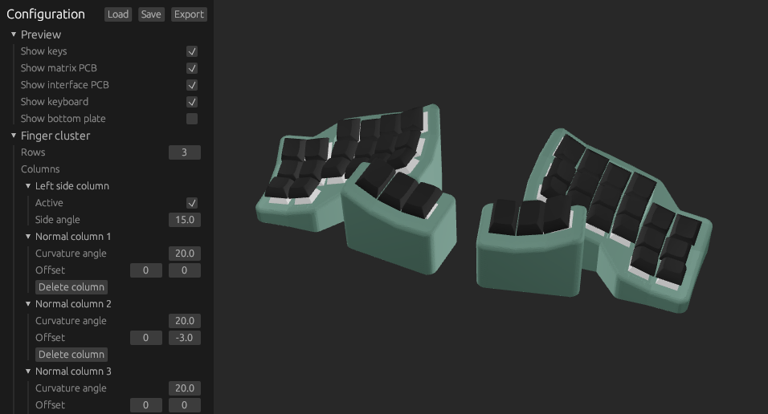

# Concavum customizer



## Overview

This repository contains the source code of the interactive customizer for the [Concavum](https://github.com/julianschuler/keyboards/tree/master/concavum), a fully parametric split keyboard featuring an ergonomic layout with ortholinear (non-staggered) columns and concave key wells.
The customizer allows for changing all kinds of parameters like the number of columns, rows and thumb keys, the curvature, the distance between keys and many more.

To get started, head over to the [latest release](https://github.com/julianschuler/concavum-customizer/releases/latest) and download the executable for your operating system. If your operating system is not supported or you want to run the latest development version instead, follow the instructions in the next section.

## Building the customizer from source

Start by cloning the repository and [installing rust](https://www.rust-lang.org/tools/install).
Run the customizer using the following:

```sh
cargo run --release
```

## Running the customizer in a browser (experimental)

There is experimental support for running the customizer in the browser.
You can find the latest version of the customizer deployed at https://julianschuler.github.io/concavum-customizer.

> **Note:** Due to the current lack of multithreading support in WebAssembly, reloading the model can be easily more than 10x slower when running in the browser compared to running natively.

To run the web version locally, start by building the code using [`wasm-pack`](https://rustwasm.github.io/wasm-pack/installer/):

```sh
wasm-pack build customizer_wasm --target no-modules --out-dir ../web/pkg --no-typescript --no-pack
```

The files in the `web` subfolder can now be served using any HTTP server, e.g. if you have Python installed:

```sh
python -m http.server -b localhost -d web
```

For the above example, the customizer should now be accessible under http://localhost:8000.

## License

This project is licensed under the GNU GPLv3 license, see [`LICENSE.txt`](LICENSE.txt) for further information.
